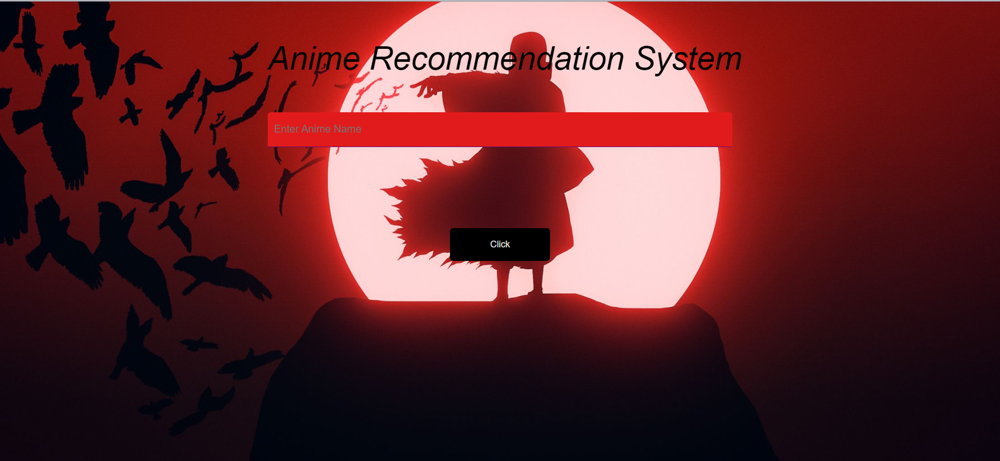

<div align="center">
  <h1>Anime Recommendation System</h1>
  <p>Discover anime similar to your favorites!</p>
</div>

## Web Application Preview


*A glimpse of the web application's user interface.*

---

## Technologies Used

<div align="center">
  
  
  
  
  
  
  
  
  
  
  
  
</div>

---

## About

The Anime Recommendation System is a machine learning-powered web app that helps users discover anime similar to their favorites. By analyzing genres, descriptions, and ratings, it provides personalized recommendations using Cosine Similarity and Natural Language Processing (NLP).

## Features

* **Personalized Recommendations:** Find anime tailored to your tastes.
* **Machine Learning Powered:** Uses Cosine Similarity and NLP for accurate suggestions.
* **Easy to Use:** Simple and intuitive web interface.

## Who is this for?

* ✅ Anime fans looking for their next watchlist
* ✅ Developers & data scientists exploring recommendation systems
* ✅ Machine learning & Flask enthusiasts interested in AI-driven web apps

## YouTube Video

Check out this video for more details on building a content-based anime recommender system:

[Build an Content Based Anime Recommender System](http://www.youtube.com/watch?v=XKYLPc-wEyc) by Data Science Solutions

## Project Repository

[Anime_Recommendation_System](https://github.com/Uvais5/Anime_Recommendation_System)

---

## Getting Started

To get a local copy up and running, follow these simple steps.

### Prerequisites

* Python 3.x
* pip (Python package installer)

### Installation

1.  **Clone the repository:**
    ```bash
    git clone [https://github.com/Uvais5/Anime_Recommendation_System.git](https://github.com/Uvais5/Anime_Recommendation_System.git)
    ```
2.  **Navigate to the project directory:**
    ```bash
    cd Anime_Recommendation_System
    ```
3.  **Create a virtual environment (recommended):**
    ```bash
    python -m venv venv
    ```
4.  **Activate the virtual environment:**
    * **Windows:**
        ```bash
        .\venv\Scripts\activate
        ```
    * **macOS/Linux:**
        ```bash
        source venv/bin/activate
        ```
5.  **Install the required dependencies:**
    ```bash
    pip install -r requirements.txt
    ```

### Usage

To run the Flask web application locally:

```bash
python app.py # Or your main Flask application file
